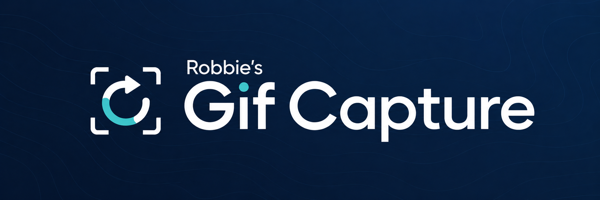

<p align="center">
  
</p>
 
# Robbie's GifCapture

A tiny macOS menu bar app: drag-select a region of your screen, record it, and it's
automatically converted to a GIF — like QuickTime Player's screen recording, but the
output is a shareable GIF instead of a .mov.

## How it works

- **Capture**: [ScreenCaptureKit](https://developer.apple.com/documentation/screencapturekit)
  records the selected region to a temporary H.264 `.mov` via `AVAssetWriter`.
- **Conversion**: [gifski](https://gif.ski) (a high-quality Rust GIF encoder) converts
  that video straight to GIF.
- **Finish**: preview and trim the recording before saving, then organize or
  re-trim captures in the built-in Library.
- Output GIFs land in `~/Desktop/GifCaptures/`.

## Requirements

- macOS 13+
- [gifski](https://gif.ski) is bundled inside the app. The optional ffmpeg
  encoder (selectable in Settings) uses a Homebrew ffmpeg if present:
  `brew install ffmpeg`

## Install (any Mac) — one command

Paste this in Terminal:

```
/bin/bash -c "$(curl -fsSL https://raw.githubusercontent.com/RobbieCase/GifCapture/main/install.sh)"
```

It downloads the latest release, installs to `/Applications`, clears the
Gatekeeper quarantine (the build is ad-hoc signed, not notarized), and launches
the app. gifski is bundled inside the app, so there's nothing else to install —
just grant Screen Recording permission when prompted on the first recording.

Manual alternative: grab `GifCapture.zip` from the
[latest release](https://github.com/RobbieCase/GifCapture/releases/latest),
unzip, move to `/Applications`, then right-click → Open on first launch.

## Build

```
./scripts/build_app.sh
```

This produces `.build/release/GifCapture.app`, ad-hoc signed with a stable bundle
identifier (`com.robbiecase.gifcapture`) so macOS remembers your Screen Recording
permission grant across rebuilds, and installs it to `/Applications/GifCapture.app`
so you can launch it from Launchpad, Spotlight, or Finder.

> The build script compiles directly with `swiftc` rather than `swift build`, because
> this machine's Command Line Tools install is missing `BuildServerProtocol.framework`
> (a dependency of SwiftPM's newer Swift Build backend). If you have a full Xcode
> install, `swift build -c release` should also work — the `Package.swift` is there
> for that case / for opening in Xcode.

## Run

Launch **GifCapture** from Launchpad, Spotlight (⌘Space), or Finder's Applications
folder — or: `open -a GifCapture`.

A record-circle icon appears in the menu bar. On first use, macOS will prompt for
**Screen Recording** permission (System Settings → Privacy & Security → Screen
Recording) — you may need to quit and relaunch the app after granting it.

## Use

1. Click the menu bar icon → **Record New GIF…**
2. Drag Selection starts with a centered 1280×720 frame (scaled down only on a
   smaller display). Drag to replace it, or adjust it with the corner/edge
   handles and move it from inside the box. Click outside to start over; Esc
   cancels.
3. Click **Record** (or press Return) to start recording.
4. While recording, everything outside the box is dimmed. Hold the **zoom
   modifier** (default Control) to follow the cursor at 2×, or hold the **draw
   modifier** (default Shift) and drag to ink fading annotations directly into
   the GIF — the pen palette beside the box (docked under the timer when the box
   spans the screen) picks the tool, color, fade time, and a "keep pen on" lock.
   The controls themselves are excluded from the capture.
5. Click **Stop** to open the editor. Trim on exact frame boundaries, play/pause,
   step one frame at a time, crop, resize, change playback speed, or export a
   reverse/ping-pong loop. Speed, reverse, and ping-pong are previewed directly
   in the editor. Crop includes common centered aspect ratios plus an interactive
   Custom Crop rectangle drawn over the video. An optional target-size export
   iteratively compresses the GIF below the requested file-size ceiling.
6. The GIF is copied to the clipboard (configurable), a notification shows the
   file size, and the Library opens with it at the top of the grid. Right-click
   a GIF in the Library for the macOS **Share…** sheet.

Encoder, quality, frame rate, output size, clipboard/MP4 export behavior,
cursor visibility, and an optional three-second countdown are configurable via
the menu bar icon → **Settings…**. "Also save an MP4 copy" writes a sibling
.mp4 next to each GIF — often ~10× smaller and it autoplays in chat apps.
You can also add a colored click indicator to every click, or use its configurable
modifier binding so only intentional clicks are highlighted.

The recording annotation palette includes freehand, line, arrow, rectangle,
ellipse, and text tools, plus undo, clear-all, adjustable stroke thickness, and
remembered tool/color/fade/text preferences.

Drag Selection remains the default capture mode. Settings can instead remember
**Click a Window** mode, which highlights the window under the pointer and snaps
to its shadowless, edge-cropped bounds, or **Full Screen** mode, which lets you
choose a display.

In Drag Selection mode, a size menu sits outside the box with exact presets for
product demos, social and marketing creative, email heroes, and common display-ad
formats such as leaderboard, billboard, rectangle, half-page, skyscraper, and
mobile banners. Presets that do not fit the selected display are disabled, and
the box remains freely adjustable after a preset is applied. Use **Add Custom
Size…** to name and save your own exact dimensions across launches; saved sizes
can also be removed from the same menu.

### Key bindings

Settings also provides global shortcuts for **Start Recording**, **Open Library**,
and **Stop Recording**. Click a shortcut button, then type a new key combination.
The defaults are Control–Command–G, Control–Command–L, and Control–Command–S.
The Stop shortcut is registered only while recording. During recording, the
configurable hold modifiers activate cursor-following Zoom and click-drag drawing;
they default to Control and Shift respectively.

When Screen Recording access is missing, Settings shows a warning with a button
that opens the correct System Settings page and brief relaunch guidance. The
warning disappears automatically once access is granted.

## Library

Open **Library…** from the menu bar to browse captures as a thumbnail grid or
Miller columns. Space opens Quick Look; context menus provide Trim, Copy, Reveal,
and Move to Trash. Drag captures between Library folders to reorganize them, or
drag a GIF from Finder into the Library to import a copy without moving the original.
Search matches filenames and tags; sorting supports newest, oldest, name, and file
size. Favorites, tags, rename, and smart Recent/Large Files/Favorites collections
are built in. Grid thumbnails show duration, pixel dimensions, and file size, and
the Library remembers its window frame and view mode.

GifCapture checks GitHub Releases for updates shortly after launch. You can also
run a manual check from **Check for Updates…**. On a locally signed development
build, that command offers to replace the test build with the latest public
GitHub release.

## Project layout

```
Sources/GifCapture/
  main.swift                    entry point (menu-bar-only app, no Dock icon)
  AppDelegate.swift             status item, menu, recording lifecycle
  SelectionOverlayController.swift  full-screen overlay windows for drag-select
  SelectionOverlayView.swift    draws the dimmed overlay + selection rectangle
  ScreenRecorder.swift          ScreenCaptureKit capture -> AVAssetWriter (.mov)
  GifConverter.swift            shells out to gifski/ffmpeg to produce the .gif
  GifImporter.swift             existing GIF -> temporary video for re-trimming
  RecordingOverlayController.swift  recording controls, zoom, and pen annotations
  TrimWindowController.swift    preview, range trim, and GIF save flow
  LibraryWindowController.swift grid/column Library, Quick Look, and organization
  UpdateChecker.swift           GitHub release checking and validated self-update
scripts/build_app.sh            compiles + assembles + ad-hoc signs the .app
```

## Known limits

- Only single-display selection is supported (the drag must start and end on the same screen).
- No audio capture (GIFs don't support audio anyway).
- Ad-hoc signed, not notarized — fine for local personal use, not for distribution.
